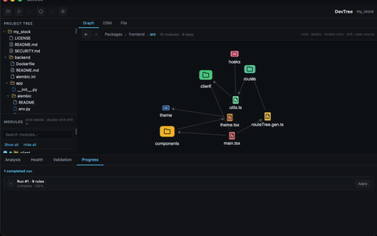
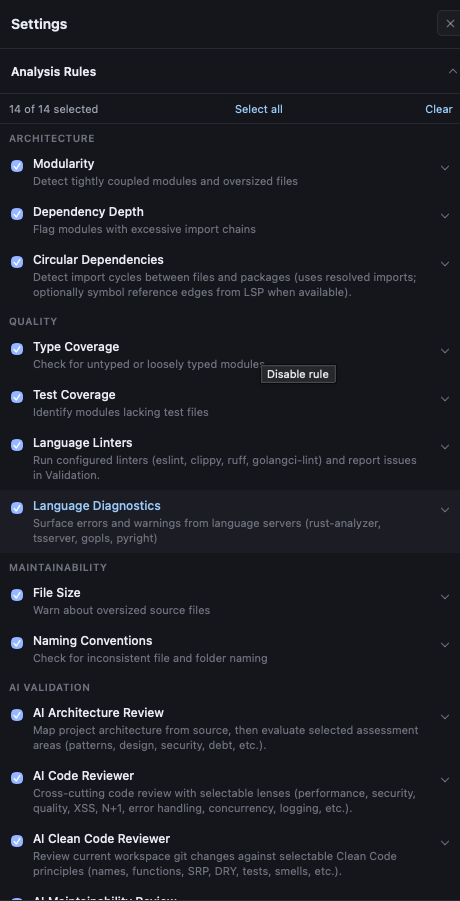
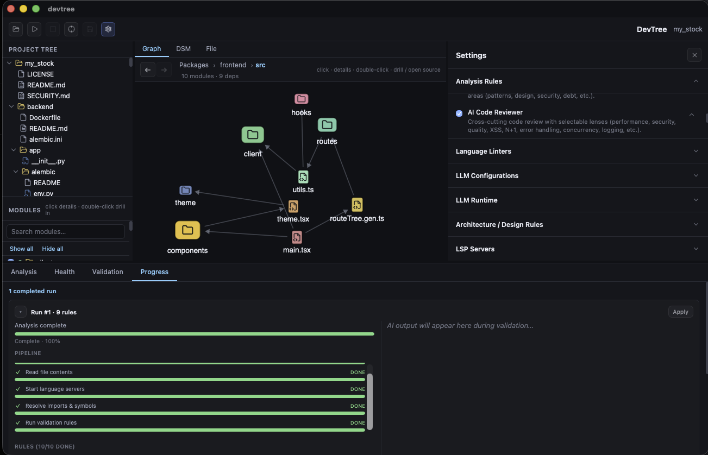
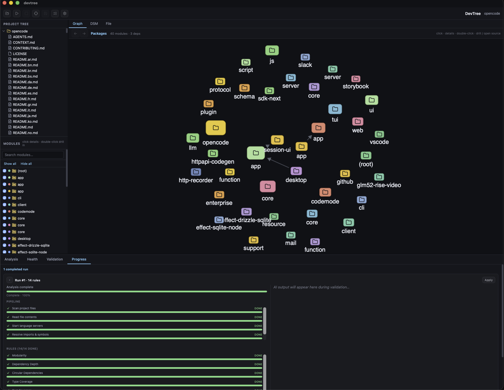
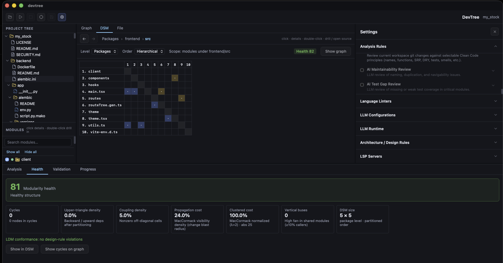
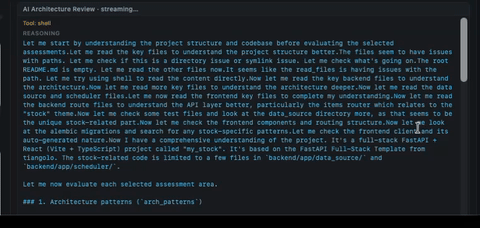
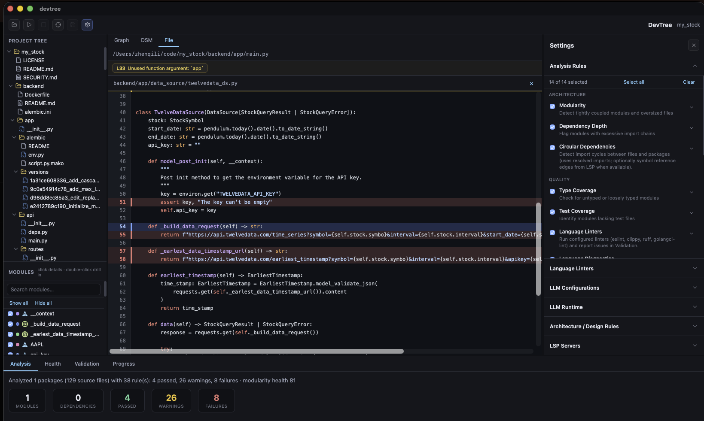
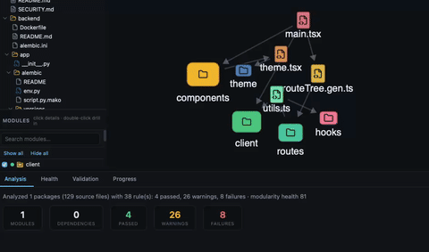

# DevTree

[](https://github.com/Naughty-Otters/DevTree/actions/workflows/ci.yml?query=branch%3Amain)
[](https://github.com/Naughty-Otters/DevTree/releases)
[](https://github.com/Naughty-Otters/DevTree/actions/workflows/ci.yml?query=branch%3Amain)
[](https://www.npmjs.com/package/devtree-ai)
[](LICENSE)

**Bridge vibe-coding demo quality → production quality. Guardrail everything you continuously deliver.**

DevTree is a desktop watchdog for AI-assisted development — architecture graph, DSM health, deterministic rules, linters/LSP, and AI review lenses (security, performance, clean code) in one place. Point it at a repo, run (or watch/schedule) analysis, and see what the vibes missed before it ships.

<p align="center">
  
</p>

**License:** [AGPL-3.0](LICENSE) · **Why / rules catalog:** [docs/FOR_VIBE_CODERS.md](docs/FOR_VIBE_CODERS.md) · **Contributing:** [CONTRIBUTING.md](CONTRIBUTING.md) · **Distribution:** [docs/DISTRIBUTION.md](docs/DISTRIBUTION.md)

---

## Why DevTree exists

| Vibe / demo reality | Production / CD need | DevTree |
| --- | --- | --- |
| Agents write a lot, fast | A second set of eyes on structure & risk | Rule board + AI lenses |
| “It runs” ≠ “it’s shippable” | Health, cycles, coupling, design rules | Graph · DSM · modularity score |
| Review is scattered across chats & tools | One bar every delivery loop | Architecture · review · security · perf in **one** app |
| CD keeps moving | Continuous guardrails | Run now · file watch · schedule |

<p align="center">
  
</p>

<p align="center"><em>CD guardrail board — architecture, quality, maintainability, and AI review (with dozens of toggleable lenses).</em></p>

### What you can check

**Deterministic:** Modularity · Dependency Depth · Circular Dependencies · Type Coverage · Test Coverage · File Size · Naming · Language Linters · Language Diagnostics · LDM design rules  

**AI Architecture assessments:** patterns · system design · scalability · stack · integration · security · performance · data · technical debt  

**AI Code Reviewer lenses:** performance · security · quality · common bugs · SQL injection · XSS · N+1 · error handling · async/concurrency · anti-patterns · logging  

**AI Clean Code (git diff):** names · functions · SRP · DRY · comments · errors · boundaries · unit tests · classes/data · smells · Boy Scout  

Full tables → **[docs/FOR_VIBE_CODERS.md](docs/FOR_VIBE_CODERS.md)**.

---

## See the codebase, not just the chat

Dependency graph for packages and files — so you can tell whether the agent glued layers together or actually respected boundaries.

<p align="center">
  
</p>

<p align="center">
  
</p>

<p align="center"><em>Example: OpenCode workspace — packages on the graph, modules in the sidebar, analysis complete in Progress.</em></p>

DSM + health score when you want numbers, not vibes:

<p align="center">
  
</p>

---

## AI review that lands in your editor

Run AI Code Reviewer / Clean Code / Architecture Review against the workspace. Findings show up next to the file — unused args, hot paths, security smells — not buried in another chat transcript.

<p align="center">
  
</p>

<p align="center">
  
</p>

Track failures and warnings while analysis runs:

<p align="center">
  
</p>

More screenshots, the demo→production pitch, and the **full rules catalog**: **[docs/FOR_VIBE_CODERS.md](docs/FOR_VIBE_CODERS.md)**.

---

## Download

### One-liner (CLI + desktop)

```bash
curl -fsSL https://raw.githubusercontent.com/Naughty-Otters/DevTree/main/install/install.sh | bash
```

### npm CLI (downloads the desktop app)

```bash
npm i -g devtree-ai@latest
devtree install          # fetch the matching GitHub Release build for this OS/arch
devtree open             # launch the installed app
devtree doctor
```

### Homebrew (macOS)

```bash
brew tap Naughty-Otters/tap
brew install --cask devtree
```

### Manual

macOS / Windows installers: [GitHub Releases](https://github.com/Naughty-Otters/DevTree/releases).

---

## Build from source

**Prerequisites:** Rust (stable) + `wasm32-unknown-unknown`, Node.js 20+, [wasm-pack](https://rustwasm.github.io/wasm-pack/), [Tauri OS deps](https://tauri.app/start/prerequisites/). Optional language servers (`rust-analyzer`, `typescript-language-server` / `vtsls`, `gopls`, `basedpyright`) improve diagnostics and symbol graphs.

```bash
npm install
npm run tauri dev
```

Frontend-only (browser, no native window): `npm run dev` → open `http://localhost:1420`.

```bash
npm run test:all      # per-file gate + Rust + TypeScript coverage
npm run tauri build   # distributable app
```

CI on `main` runs tests with coverage, builds macOS (Apple Silicon) + Windows artifacts, and refreshes README badges under [`.github/badges/`](.github/badges/).

### Releasing

**Manual (Actions UI):** GitHub → **Actions** → **Release** → **Run workflow** → enter version (e.g. `0.1.0`) → Run. Creates a draft GitHub Release for `v{version}` **and** uploads the same installers as **Actions artifacts** on that run (download from the workflow summary).

**Tag push:**

```bash
npm run sync:version
git tag v0.1.0
git push origin v0.1.0
```

Or from a machine with `gh` auth:

```bash
gh workflow run Release -f version=0.1.0 -f draft=true
```

Release builds sign/notarize with the same `MAC_*` / `WIN_*` secrets as OpenFDE (GitHub Environment **`release`**). Optional npm / Homebrew tap updates run when `NPM_TOKEN` / `HOMEBREW_TAP_TOKEN` are set. See [docs/DISTRIBUTION.md](docs/DISTRIBUTION.md).

### Project layout

```
DevTree/
├── crates/devtree-core/   # Graph + layout (native + wasm)
├── src-tauri/             # Tauri Rust backend
├── src/                   # Vite + TypeScript UI
├── media/                 # README screenshots & GIFs
└── packages/cli/          # npm package devtree-ai
```

### Troubleshooting

- **`the --artifact-dir flag is unstable` from `wasm-pack`:** upgrade with `cargo install wasm-pack --force`.
- **Stale absolute paths after moving the repo:** `rm -rf target && cargo build --workspace`.

### Recommended IDE setup

[VS Code](https://code.visualstudio.com/) + [Tauri](https://marketplace.visualstudio.com/items?itemName=tauri-apps.tauri-vscode) + [rust-analyzer](https://marketplace.visualstudio.com/items?itemName=rust-lang.rust-analyzer).
