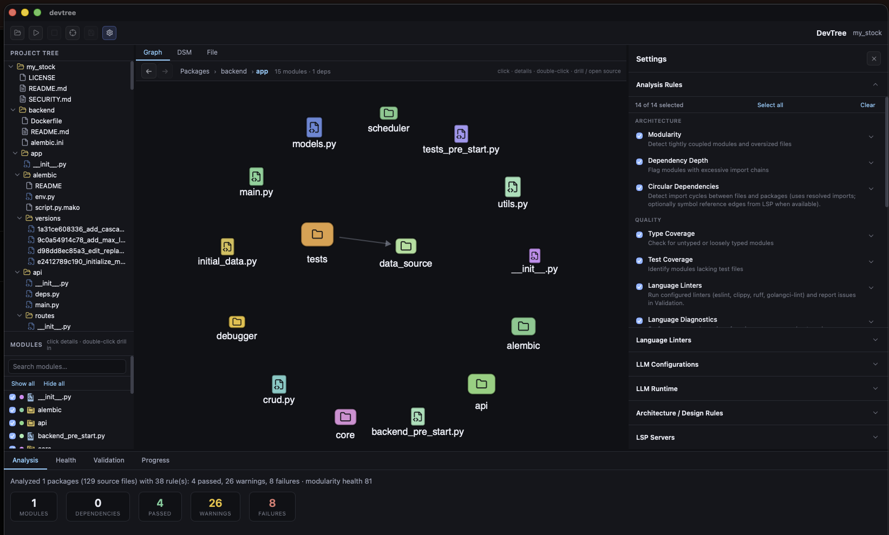

# DevTree for vibe coders

**Goal:** bridge **vibe-coding demo quality → production quality** — guardrail everything you continuously deliver.

Agents ship at chat speed. That’s the point of vibe coding — and why you can’t **totally trust** what lands in the tree before it hits main, staging, or customers. DevTree is the desktop watchdog that sits beside your continuous delivery loop: dependency graph, DSM health, deterministic rules, linters/LSP, and AI review lenses (architecture, security, performance, clean code) in **one** place.

```text
  Vibe / agent demo          DevTree guardrails           Production CD
  ─────────────────          ──────────────────           ─────────────
  “It runs in chat”    →     graph · health · rules  →   ship with eyes open
  Fast diffs           →     watch / schedule runs   →   catch drift early
  Scattered reviews    →     one rule board          →   same bar every push
```

---

## 1. You can’t totally trust vibe coding

LLMs are great at “make it work.” They’re weaker at “keep the architecture honest.” Coupling creeps in. Cycles appear. Untested modules multiply. Security and performance issues hide in code that *looks* fine in the chat pane.

DevTree scores the workspace — **passed / warnings / failures** plus modularity health — so demo polish doesn’t masquerade as production readiness.

<p align="center">
  
</p>

<p align="center"><em>Graph view + live analysis bar — what passed, what warned, what failed.</em></p>

When something’s wrong, jump into the file and see it highlighted — not summarized away in another transcript.

<p align="center">
  
</p>

---

## 2. You need a tool to watch for you (CD guardrails)

Chat is ephemeral. Continuous delivery is not. DevTree is a **persistent watchdog** on the workspace:

- Open a project, select the rule board, hit **Run** — or enable **file watch** / **cron schedule** so every delivery loop re-checks.
- Progress + AI stream stay in the Progress tab while you keep coding.
- Same gates locally that you care about before merge: structure, types, tests, linters, diagnostics, AI lenses.

<p align="center">
  
</p>

<p align="center">
  
</p>

<p align="center"><em>Your CD guardrail board — toggle what must pass before you trust the build.</em></p>

Error and warning tracking while a run is in flight:

<p align="center">
  
</p>

---

## 3. Architecture · code review · security · performance — one place

Stop bouncing between “ask the agent again,” a separate linter, and a security checklist. DevTree stacks **deterministic rules**, **tooling (LSP/linters)**, **design rules (LDM)**, and **AI validation** so demo → production is one continuous bar.

AI validation can use a cloud API key **or** an already-installed **Claude Code / Codex / Gemini CLI** (DevTree spawns a headless run with your local login — it does not join an open terminal session).

| Pillar | Guardrails in DevTree |
| --- | --- |
| **Architecture** | Graph, DSM, modularity health, cycles, depth, LDM design rules, AI architecture assessments |
| **Code review** | AI Code Reviewer lenses, Clean Code principles on git diff, maintainability & test-gap reviews |
| **Security** | Security architecture assessment + lenses (security, XSS, SQL injection) + LSP/linter findings |
| **Performance** | Performance architecture assessment + lenses (performance, N+1, async/concurrency) + coupling metrics |

### Architecture you can see

<p align="center">
  
</p>

<p align="center">
  
</p>

<p align="center"><em>Real workspace — OpenCode packages on the graph with a finished rule pipeline in Progress.</em></p>

### Health you can measure

<p align="center">
  
</p>

### Review that streams while you work

<p align="center">
  
</p>

---

## Rules catalog (what you can check)

Toggle any mix below. Deterministic rules always run locally; AI rules need an LLM config.

### Architecture (deterministic)

| Rule | What it guards |
| --- | --- |
| **Modularity** | Tightly coupled / oversized modules |
| **Dependency Depth** | Excessively deep import chains |
| **Circular Dependencies** | File, package, and optional LSP symbol-reference cycles |
| **Architecture Conformance (LDM)** | Layer / forbid design rules on the DSM |

### Quality (deterministic + tooling)

| Rule | What it guards |
| --- | --- |
| **Type Coverage** | Untyped / loosely typed modules (e.g. plain JS) |
| **Test Coverage** | Modules missing corresponding tests |
| **Language Linters** | eslint, biome, oxlint, clippy, ruff, pylint, flake8, golangci-lint, staticcheck, … |
| **Language Diagnostics** | rust-analyzer, tsserver/vtsls, gopls, pyright/basedpyright/pylsp, jdtls, … |

### Maintainability (deterministic)

| Rule | What it guards |
| --- | --- |
| **File Size** | Oversized source files |
| **Naming Conventions** | Spaces / mixed-case path smells |

### AI Validation — top-level rules

| Rule | What it guards |
| --- | --- |
| **AI Architecture Review** | Map architecture from source, then score selected assessments |
| **AI Code Reviewer** | Cross-cutting review with selectable security/perf/quality lenses |
| **AI Clean Code Reviewer** | Workspace **git diff** vs Clean Code principles |
| **AI Maintainability Review** | Naming, duplication, navigability |
| **AI Test Gap Review** | Missing / weak tests on critical modules |

### AI Architecture assessments (lenses under Architecture Review)

Enable any subset:

- Architecture patterns  
- System design  
- Scalability  
- Technology stack  
- Integration patterns  
- Security architecture  
- Performance architecture  
- Data architecture  
- Technical debt  

### AI Code Reviewer lenses

Enable any subset:

- Performance  
- Security  
- Universal quality  
- Common bugs  
- SQL injection  
- XSS prevention  
- N+1 queries  
- Error handling  
- Async & concurrency  
- Anti-patterns  
- Logging strategy  

### AI Clean Code principles (git diff)

Enable any subset:

- Meaningful names  
- Functions  
- Single responsibility  
- DRY  
- Comments  
- Error handling  
- Boundaries  
- Unit tests  
- Classes & data  
- Code smells  
- Boy Scout rule  

---

## Typical continuous-delivery loop

1. Vibe an agent to change the codebase (demo-quality spike is fine).
2. Keep the folder open in DevTree — or trigger on **watch** / **schedule**.
3. Run the guardrail board: structure + types/tests/linters + the AI lenses you require for production.
4. Fix what fails; merge / deploy when the board matches **your** production bar — not “the chat said LGTM.”

```bash
# Install + launch
curl -fsSL https://raw.githubusercontent.com/Naughty-Otters/DevTree/main/install/install.sh | bash
# or
npm i -g devtree-ai@latest && devtree install && devtree open
```

Back to the [main README](../README.md) for badges, build-from-source, and release notes.
